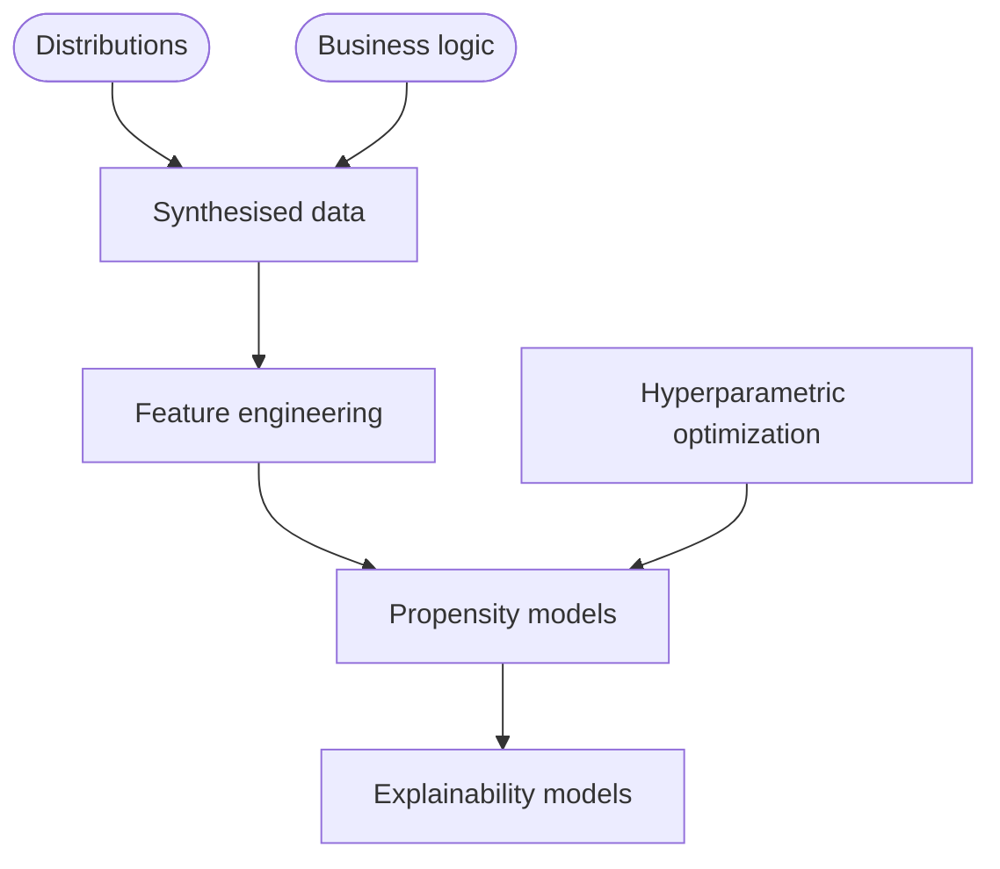

Case scheme:

```mermaid
flowchart TD;
    dist([Distributions])-->synth([Synthesised data]);
    logic([Business logic])-->synth[Synthesised data];
    synth[Synthesised data]-->feat[Feature engineering];
    feat[Feature engineering]-->prop[Propensity models];
    hyper[Hyperparametric optimization]-->prop[Propensity models];
    prop[Propensity models]-->expl[Explainability models];
```
