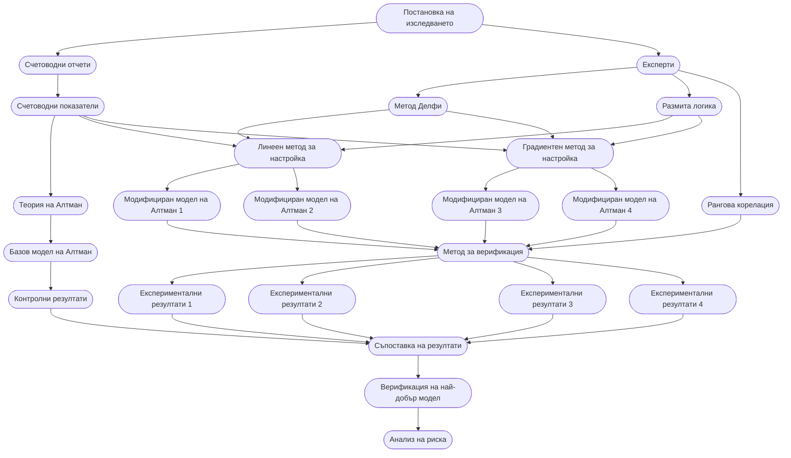

```mermaid
flowchart TD;
    post([Постановка на изследването])-->schet([Счетоводни отчети]);
    post([Постановка на изследването])-->expert([Експерти]);
    schet([Счетоводни отчети])-->ratios([Счетоводни показатели]);
    expert([Експерти])-->deplphi([Метод Делфи]);
    expert([Експерти])-->fuzzi([Размита логика]);
    expert([Експерти])-->rank([Рангова корелация]);
    ratios([Счетоводни показатели])-->altman([Теория на Алтман]);
    ratios([Счетоводни показатели])-->linest([Линеен метод за настройка]);
    ratios([Счетоводни показатели])-->grad([Градиентен мертод за настройка]);
    deplphi([Метод Делфи])-->linest([Линеен метод за настройка]);
    deplphi([Метод Делфи])-->grad([Градиентен мертод за настройка]);
    fuzzi([Размита логика])-->linest([Линеен метод за настройка]);
    fuzzi([Размита логика])-->grad([Градиентен мертод за настройка]);
    rank([Рангова корелация])-->verif([Метод за верификация]);
    altman([Теория на Алтман])-->zscore([Базов модел на Алтман]);
    linest([Линеен метод за настройка])-->zscore1([Модифициран модел на Алтман 1]);
    linest([Линеен метод за настройка])-->zscore2([Модифициран модел на Алтман 2]);
    grad([Градиентен метод за настройка])-->zscore3([Модифициран модел на Алтман 3]);
    grad([Градиентен метод за настройка])-->zscore4([Модифициран модел на Алтман 4]);
    zscore1([Модифициран модел на Алтман 1])-->verif([Метод за верификация]);
    zscore2([Модифициран модел на Алтман 2])-->verif([Метод за верификация]);
    zscore3([Модифициран модел на Алтман 3])-->verif([Метод за верификация]);
    zscore4([Модифициран модел на Алтман 4])-->verif([Метод за верификация]);
    zscore([Базов модел на Алтман])-->control([Контролни резултати]);
    verif([Метод за верификация])-->exp1([Експериментални резултати 1]);
    verif([Метод за верификация])-->exp2([Експериментални резултати 2]);
    verif([Метод за верификация])-->exp3([Експериментални резултати 3]);
    verif([Метод за верификация])-->exp4([Експериментални резултати 4]);
    control([Контролни резултати])-->compare([Съпоставка на резултати]);
    exp1([Експериментални резултати 1])-->compare([Съпоставка на резултати]);
    exp2([Експериментални резултати 2])-->compare([Съпоставка на резултати]);
    exp3([Експериментални резултати 3])-->compare([Съпоставка на резултати]);
    exp4([Експериментални резултати 4])-->compare([Съпоставка на резултати]);
    compare([Съпоставка на резултати])-->bestmodel([Верификация на най-добър модел]);
    bestmodel([Верификация на най-добър модел])-->analysis([Анализ на риска]);
```
