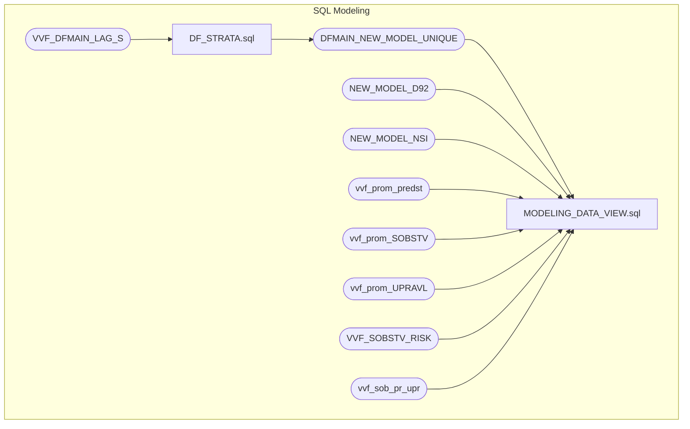

```mermaid
flowchart TD;
  subgraph sql_model["SQL Modeling"]
    direction LR
    input_data([VVF_DFMAIN_LAG_S])-->strata[DF_STRATA.sql];
    strata[DF_STRATA.sql]-->strata_table([DFMAIN_NEW_MODEL_UNIQUE]);
    strata_table([DFMAIN_NEW_MODEL_UNIQUE])-->modeling[MODELING_DATA_VIEW.sql];
    dekl92([NEW_MODEL_D92])-->modeling[MODELING_DATA_VIEW.sql];
    gfo([NEW_MODEL_NSI])-->modeling[MODELING_DATA_VIEW.sql];
    flag_predst([vvf_prom_predst])-->modeling[MODELING_DATA_VIEW.sql];
    flag_sobst([vvf_prom_SOBSTV])-->modeling[MODELING_DATA_VIEW.sql];
    flag_uprav([vvf_prom_UPRAVL])-->modeling[MODELING_DATA_VIEW.sql];
    flag_sobst_risk([VVF_SOBSTV_RISK])-->modeling[MODELING_DATA_VIEW.sql];
    flag_promeni([vvf_sob_pr_upr])-->modeling[MODELING_DATA_VIEW.sql];
  end


```
