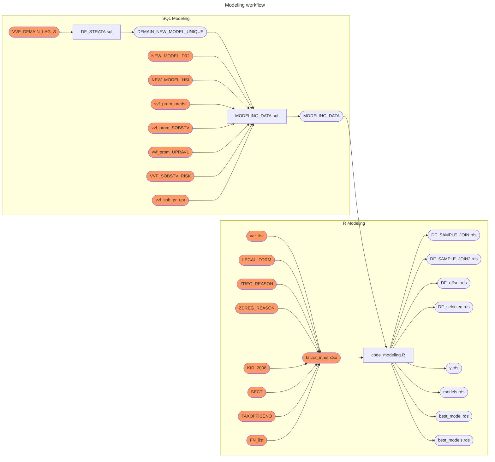

```mermaid
---
title: Modeling workflow
---
flowchart LR;
  subgraph sql_modeling["SQL Modeling"]
    direction LR
    input_data([VVF_DFMAIN_LAG_S])-->strata[DF_STRATA.sql];
    strata[DF_STRATA.sql]-->strata_table([DFMAIN_NEW_MODEL_UNIQUE]);
    strata_table([DFMAIN_NEW_MODEL_UNIQUE])-->modeling[MODELING_DATA.sql];
    dekl92([NEW_MODEL_D92])-->modeling[MODELING_DATA.sql];
    gfo([NEW_MODEL_NSI])-->modeling[MODELING_DATA.sql];
    flag_predst([vvf_prom_predst])-->modeling[MODELING_DATA.sql];
    flag_sobst([vvf_prom_SOBSTV])-->modeling[MODELING_DATA.sql];
    flag_uprav([vvf_prom_UPRAVL])-->modeling[MODELING_DATA.sql];
    flag_sobst_risk([VVF_SOBSTV_RISK])-->modeling[MODELING_DATA.sql];
    flag_promeni([vvf_sob_pr_upr])-->modeling[MODELING_DATA.sql];
    modeling[MODELING_DATA.sql]-->modeling_table([MODELING_DATA]);
    class input_data,dekl92,gfo,flag_predst,flag_sobst,flag_uprav,flag_sobst_risk,flag_promeni ToBePrapared;
    classDef ToBePrapared fill:#f96;  
   
  end
  subgraph R_modeling["R Modeling"]
    direction LR
    modeling_table([MODELING_DATA])-->r_model[code_modeling.R];
    r_model[code_modeling.R]-->output1([DF_SAMPLE_JOIN.rds]);
    r_model[code_modeling.R]-->output2([DF_SAMPLE_JOIN2.rds]);
    r_model[code_modeling.R]-->output3([DF_offset.rds]);
    r_model[code_modeling.R]-->output4([DF_selected.rds]);
    r_model[code_modeling.R]-->output5([y.rds]);
    r_model[code_modeling.R]-->output6([models.rds]);
    r_model[code_modeling.R]-->output7([best_model.rds]);
    r_model[code_modeling.R]-->output8([best_models.rds]);

    var_list([var_list])-->user_input_model([factor_input.xlsx]);
    legal_form([LEGAL_FORM])-->user_input_model([factor_input.xlsx]);
    zreg_reason([ZREG_REASON])-->user_input_model([factor_input.xlsx]);
    zdreg_reason([ZDREG_REASON])-->user_input_model([factor_input.xlsx]);
    kid_2008([KID_2008])-->user_input_model([factor_input.xlsx]);
    sect([SECT])-->user_input_model([factor_input.xlsx]);
    taxofficeno([TAXOFFICENO])-->user_input_model([factor_input.xlsx]);
    fn_list([FN_list])-->user_input_model([factor_input.xlsx]);
    user_input_model([factor_input.xlsx])-->r_model[code_modeling.R];
    class var_list,legal_form,zreg_reason,zdreg_reason,kid_2008,sect,taxofficeno,fn_list,user_input_model ToBePrapared;
    classDef ToBePrapared fill:#f96;  
end
    
  


```
