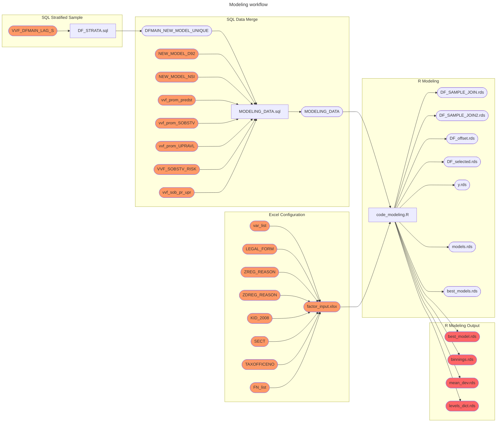
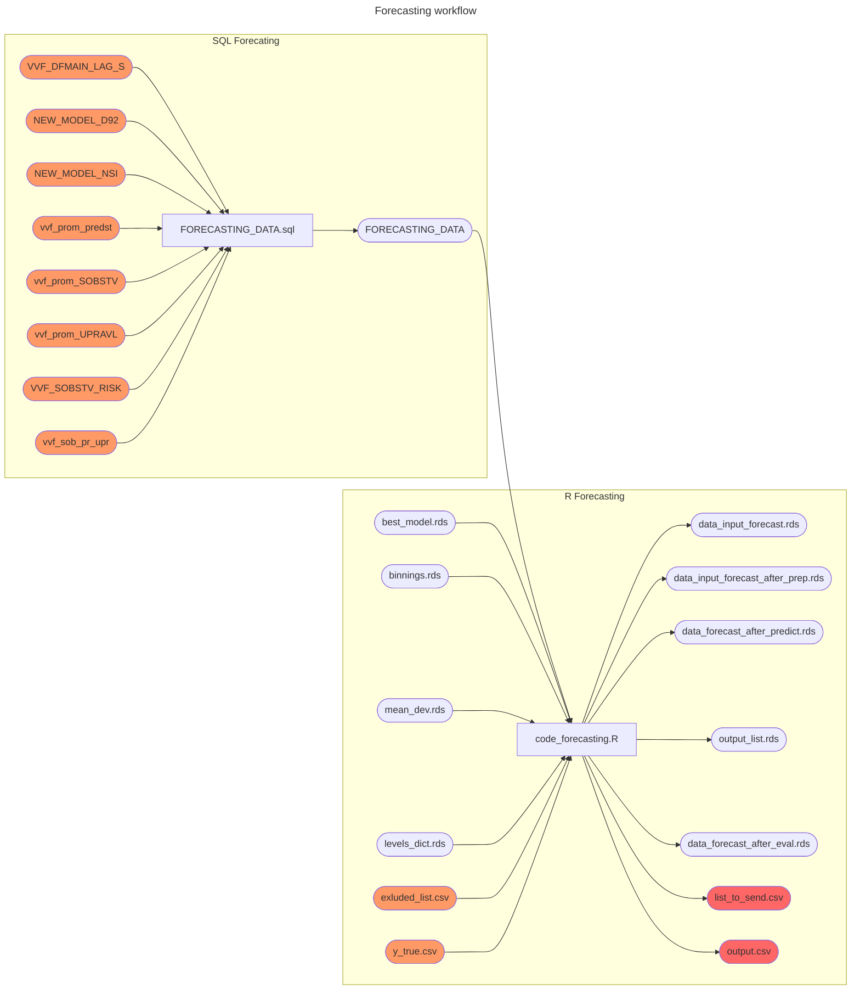

```mermaid
---
title: Modeling workflow
---
flowchart LR;

subgraph sql_stratified["SQL Stratified Sample"]
    input_data([VVF_DFMAIN_LAG_S])-->strata[DF_STRATA.sql];
    class input_data,dekl92,gfo,flag_predst,flag_sobst,flag_uprav,flag_sobst_risk,flag_promeni ToBePrapared;
    classDef ToBePrapared fill:#f96;  
end

subgraph sql_modeling["SQL Data Merge"]
    strata[DF_STRATA.sql]-->strata_table([DFMAIN_NEW_MODEL_UNIQUE]);
    strata_table([DFMAIN_NEW_MODEL_UNIQUE])-->modeling[MODELING_DATA.sql];
    dekl92([NEW_MODEL_D92])-->modeling[MODELING_DATA.sql];
    gfo([NEW_MODEL_NSI])-->modeling[MODELING_DATA.sql];
    flag_predst([vvf_prom_predst])-->modeling[MODELING_DATA.sql];
    flag_sobst([vvf_prom_SOBSTV])-->modeling[MODELING_DATA.sql];
    flag_uprav([vvf_prom_UPRAVL])-->modeling[MODELING_DATA.sql];
    flag_sobst_risk([VVF_SOBSTV_RISK])-->modeling[MODELING_DATA.sql];
    flag_promeni([vvf_sob_pr_upr])-->modeling[MODELING_DATA.sql];
    modeling[MODELING_DATA.sql]-->modeling_table([MODELING_DATA]);
    class input_data,dekl92,gfo,flag_predst,flag_sobst,flag_uprav,flag_sobst_risk,flag_promeni ToBePrapared;
    classDef ToBePrapared fill:#f96;  
end

subgraph excel_input["Excel Configuration"]
    var_list([var_list])-->user_input_model([factor_input.xlsx]);
    legal_form([LEGAL_FORM])-->user_input_model([factor_input.xlsx]);
    zreg_reason([ZREG_REASON])-->user_input_model([factor_input.xlsx]);
    zdreg_reason([ZDREG_REASON])-->user_input_model([factor_input.xlsx]);
    kid_2008([KID_2008])-->user_input_model([factor_input.xlsx]);
    sect([SECT])-->user_input_model([factor_input.xlsx]);
    taxofficeno([TAXOFFICENO])-->user_input_model([factor_input.xlsx]);
    fn_list([FN_list])-->user_input_model([factor_input.xlsx]);
    class var_list,legal_form,zreg_reason,zdreg_reason,kid_2008,sect,taxofficeno,fn_list,user_input_model ToBePrapared;
    classDef ToBePrapared fill:#f96;
end

subgraph R_modeling["R Modeling"]
    modeling_table([MODELING_DATA])-->r_model[code_modeling.R];
    user_input_model([factor_input.xlsx])-->r_model[code_modeling.R];
    r_model[code_modeling.R]-->output1([DF_SAMPLE_JOIN.rds]);
    r_model[code_modeling.R]-->output2([DF_SAMPLE_JOIN2.rds]);
    r_model[code_modeling.R]-->output3([DF_offset.rds]);
    r_model[code_modeling.R]-->output4([DF_selected.rds]);
    r_model[code_modeling.R]-->output5([y.rds]);
    r_model[code_modeling.R]-->output6([models.rds]);
    r_model[code_modeling.R]-->output7([best_models.rds]);
end

subgraph R_modeling_output["R Modeling Output"]
    r_model[code_modeling.R]-->best_model([best_model.rds]);
    r_model[code_modeling.R]-->binnings([binnings.rds]);
    r_model[code_modeling.R]-->mean_dev([mean_dev.rds]);
    r_model[code_modeling.R]-->levels_dict([levels_dict.rds]);
    class best_model,binnings,mean_dev,levels_dict ToBeUsed;
    classDef ToBeUsed fill:#f66;
end
```

```mermaid
---
title: Forecasting workflow
---
flowchart LR;
  subgraph sql_forecasting["SQL Forecating"]
    direction LR
    input_data([VVF_DFMAIN_LAG_S])-->sql_forecast[FORECASTING_DATA.sql];
    dekl92([NEW_MODEL_D92])-->sql_forecast[FORECASTING_DATA.sql];
    gfo([NEW_MODEL_NSI])-->sql_forecast[FORECASTING_DATA.sql];
    flag_predst([vvf_prom_predst])-->sql_forecast[FORECASTING_DATA.sql];
    flag_sobst([vvf_prom_SOBSTV])-->sql_forecast[FORECASTING_DATA.sql];
    flag_uprav([vvf_prom_UPRAVL])-->sql_forecast[FORECASTING_DATA.sql];
    flag_sobst_risk([VVF_SOBSTV_RISK])-->sql_forecast[FORECASTING_DATA.sql];
    flag_promeni([vvf_sob_pr_upr])-->sql_forecast[FORECASTING_DATA.sql];
    sql_forecast[FORECASTING_DATA.sql]-->forecasting_table([FORECASTING_DATA]);
    class input_data,dekl92,gfo,flag_predst,flag_sobst,flag_uprav,flag_sobst_risk,flag_promeni ToBePrapared;
    classDef ToBePrapared fill:#f96;  
   
  end
subgraph R_forecasting["R Forecasting"]
    direction LR
    forecasting_table([FORECASTING_DATA])-->r_forecast[code_forecasting.R];
    r_forecast[code_forecasting.R]-->output9([data_input_forecast.rds]);
    r_forecast[code_forecasting.R]-->output10([data_input_forecast_after_prep.rds]);
    r_forecast[code_forecasting.R]-->output11([data_forecast_after_predict.rds]);
    r_forecast[code_forecasting.R]-->output12([output_list.rds]);
    r_forecast[code_forecasting.R]-->output13([data_forecast_after_eval.rds]);
    best_model([best_model.rds])-->r_forecast[code_forecasting.R];
    binnings([binnings.rds])-->r_forecast[code_forecasting.R];
    mean_dev([mean_dev.rds])-->r_forecast[code_forecasting.R];
    levels_dict([levels_dict.rds])-->r_forecast[code_forecasting.R];
    excl_list([exluded_list.csv])-->r_forecast[code_forecasting.R];
    r_forecast[code_forecasting.R]-->output_list([list_to_send.csv]);
    r_forecast[code_forecasting.R]-->explained_list([output.csv]);
    field_test([y_true.csv])-->r_forecast[code_forecasting.R];
    style field_test fill:#f96; 

    class var_list,legal_form,zreg_reason,zdreg_reason,kid_2008,sect,taxofficeno,fn_list,user_input_model,excl_list ToBePrapared;
    classDef ToBePrapared fill:#f96;

    class output_list,explained_list ToBeUsed;
    classDef ToBeUsed fill:#f66;
end
      
  


```

